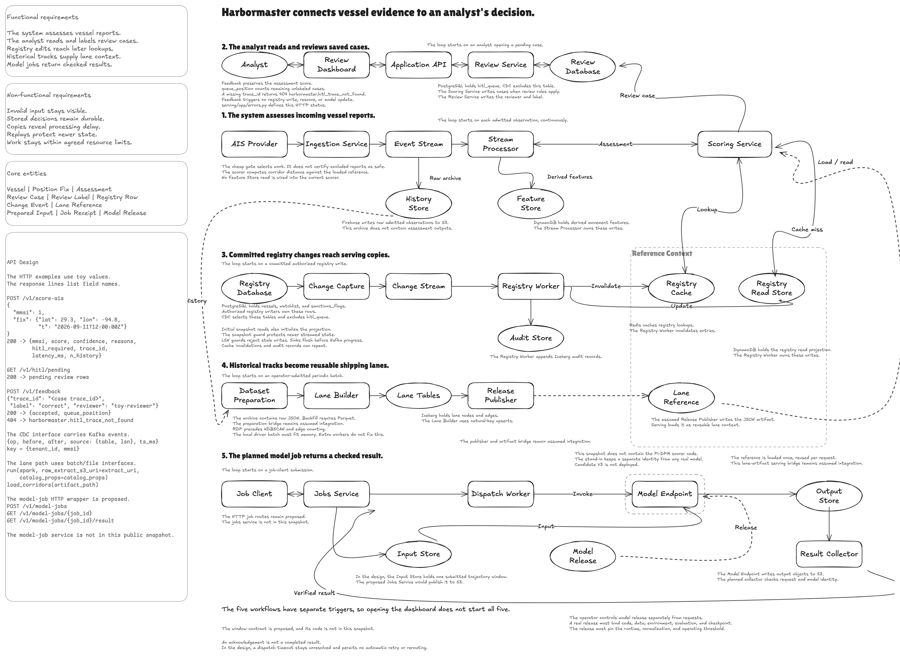
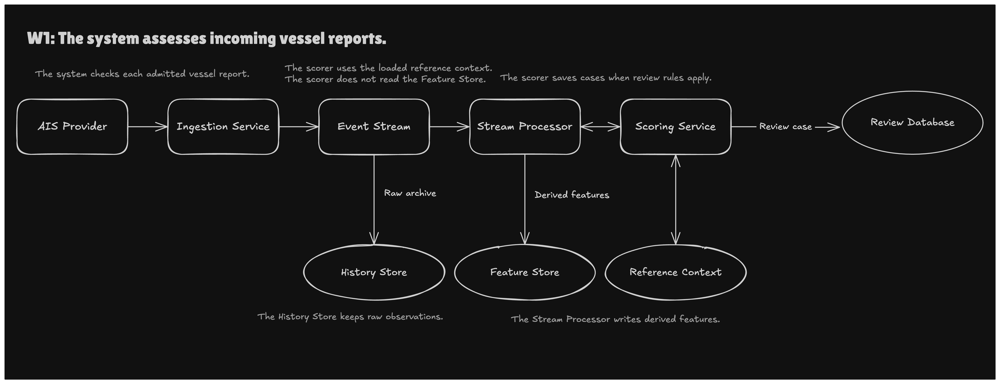
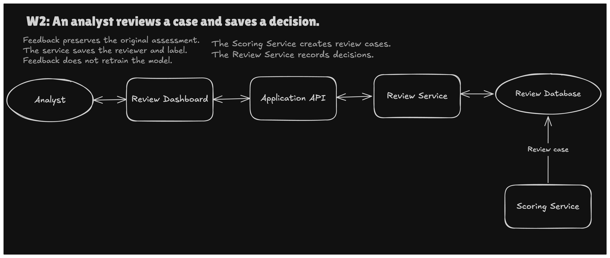
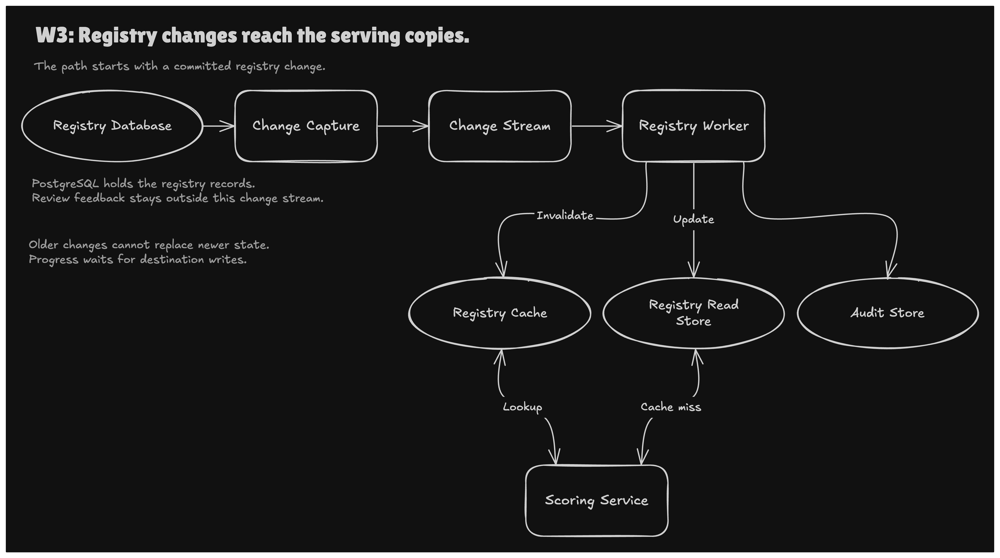
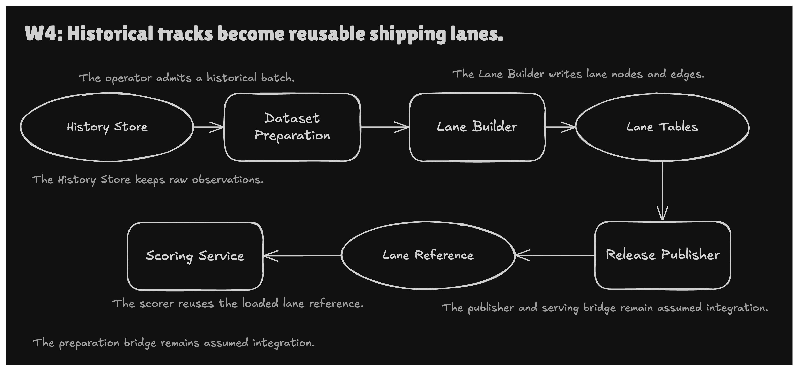
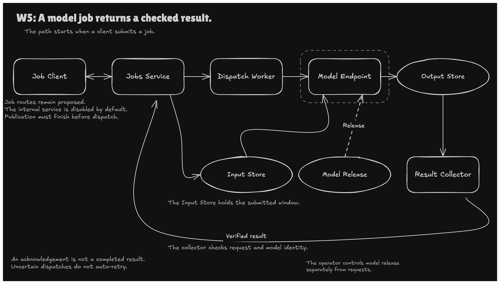

# The five Harbormaster workflows

Harbormaster helps an analyst examine unusual vessel movement and record a review decision about it. This guide explains the system through five workflows, and each workflow has its own trigger and its own schedule. A dashboard request does not run all five workflows in sequence.

*This overview shows the integrated target design, and it does not show a deployed system. The same drawing is available as a vector file, [overview.svg](../assets/diagrams/overview.svg), and its editable source is [overview-merged-system.excalidraw](../assets/diagrams/src/overview-merged-system.excalidraw).*

The overview numbers the workflows 1 to 5, and the per-workflow diagrams label them W1 to W5. The overview draws Workflow 2 at the top, above Workflow 1. Three dashed links in the overview mark assumed integration. They run from the History Store to Dataset Preparation, from the Release Publisher to the Lane Reference, and from the Lane Reference to the Scoring Service. The fourth dashed link, labeled Release, marks the operator's model release. These five workflow diagrams are the exact versions used in the project presentation. The boxes in each diagram name logical responsibilities. Two boxes can share one deployed service. For example, the review handlers and the scoring handlers both run inside one FastAPI application. The architecture view is in [ARCHITECTURE.md](ARCHITECTURE.md), and the debugging history is in [WAR_STORIES.md](WAR_STORIES.md).

## Status boundaries

- The AWS demonstration environment is no longer running, and this repository deploys nothing by default.
- Every AWS run described here happened in a bounded demonstration window, and this guide labels local runs as local.
- Candidate V3, a later Pi-DPM model candidate, is not deployed, and Production V1 is not accepted.
- [HONESTY.md](HONESTY.md) lists what is real, what is simulated, and what was never built.

## Workflow 1: Check incoming vessel reports

*The W1 diagram shows reports moving from the AIS provider through ingestion, the event stream, and the stream processor to the scoring service and the review database. The AWS parts of this path ran only in bounded demonstration windows. In this snapshot, a synthetic fixture replay stands in for the AIS provider, because live ingestion is disabled.*

**What it does:** The system receives a vessel position report, checks it, and places it on an event stream. A stream processor compares the report with recent reports for the same vessel and asks the scoring service for an assessment. The scorer saves a review case in PostgreSQL when one of its review rules applies.

**Components:**

- An AIS provider supplies the reports. This snapshot runs only the synthetic fixture replay (`streaming/replay/`), and the live-feed parser remains as tested reference code.
- A Fargate ingestion service parses and normalizes each report before it admits the report to the stream (`streaming/ingestor/`).
- Amazon Kinesis holds admitted reports until the stream processor can read them.
- Apache Flink keeps per-vessel state, computes movement features, and applies the cheap P_phys physics gate (`streaming/flink/`).
- A FastAPI scoring service runs the gap, speed, and corridor-deviation detectors behind `POST /v1/score-ais` (`serving/app/`).
- PostgreSQL stores review cases in the `hitl_queue` table, which Workflow 2 reads.
- Side branches write derived features to DynamoDB and send raw observations to S3 through Firehose.

**Main challenge:** During the first live run, the review queue stayed empty even though the pipeline reported no errors. The Flink job sent precomputed features under a `features` key, but the scoring API expected the vessel identifier, the current fix, and recent history. The API rejected every request with HTTP 422, and a best-effort exception handler hid those rejections ([war story P15](WAR_STORIES.md#p15-a-precomputed-feature-payload-silently-drifted-from-the-real-serving-schema)).

**Fix:** The Flink job now sends `{mmsi, fix, history}` in the exact contract the API expects. That fix exposed a second bug. The planner adds the gap detector only when a request carries at least three history points, but Flink kept only one prior fix. The job now keeps a rolling window of recent fixes, so the gap detector runs ([war story P16](WAR_STORIES.md#p16-a-deterministic-planner-silently-skips-a-detector-below-its-history-threshold)).

**Measured evidence:** A 36,000-request load test at 10 requests per second for one hour returned 35,999 HTTP 200 responses and one 503, with client p95 142.751 ms and p99 240.283 ms. The test repeated one fixed request against `POST /v1/score-ais` in a bounded AWS window, so it measures serving capacity and says nothing about model quality.

**What remains unbuilt:**

- The Flink job is a per-event keyed realization without event-time windows or watermarks, so it does not reconcile late or out-of-order reports ([ADR 0001](adr/0001-streaming-per-event-realization.md)).
- The scorer uses the request payload for its assessment, and it does not read the feature store before scoring.
- The rendezvous finder has tests, but no API route calls it, because it needs a multi-vessel endpoint that does not exist.
- Live AIS ingestion is disabled in this snapshot.
- No accepted production pilot with an agreed SLO has run, because Production V1 is not accepted.

## Workflow 2: Save an analyst review without changing the original assessment

*The W2 diagram shows the analyst's path from the review dashboard through the application API and the review service to the review database. The scoring service from Workflow 1 creates the review cases that this path reads.*

**What it does:** An analyst opens pending review cases in a dashboard, reads the evidence, and records a label such as correct, incorrect, or ambiguous. The review service saves the label and the reviewer name, and it keeps the original automated score unchanged. Feedback is stored for later comparison, and it does not retrain the model.

**Components:**

- A Streamlit console is the analyst's dashboard, and its Python process makes the HTTP calls (`serving/frontend/console.py`).
- The FastAPI application serves `GET /v1/hitl/pending` and `POST /v1/feedback` for the dashboard (`serving/app/main.py`).
- The review service reads and updates rows in the PostgreSQL `hitl_queue` table (`serving/app/hitl.py`).
- On AWS, API Gateway and a VPC Link led to the FastAPI service on ECS Fargate during the demonstration windows.

**Main challenge:** A code audit found that the AWS task definition never injected the database credential that the review backend needed. The backend had quietly fallen back to an in-memory stub on real infrastructure, so saved reviews lived only in process memory. A second risk involved the update itself, because a feedback write that matched the wrong row could change another case or overwrite the automated score.

**Fix:** The task definition now injects the credential. The backend now stops at startup on a missing module or on a schema, migration, or row-level security failure. It still uses process memory without a warning when no database connection is configured, and it falls back to memory with a warning when the database is unreachable at startup. The feedback write updates only the `label` and `reviewer` columns for the matching trace ID. An unknown trace ID returns an explicit error, and the tests cover label updates, unknown trace IDs, and duplicate enqueue by trace ID.

**What remains unbuilt:**

- The queue still uses process memory when no database connection is configured, and it falls back to memory with a warning when PostgreSQL is unreachable at startup. A production deployment would need both paths removed.
- The API accepts the reviewer name from the caller and does not bind it to an authenticated identity.
- The project has not decided how an `ambiguous` label should count in later evaluation.

## Workflow 3: Keep registry copies and cached answers current

*The W3 diagram shows a committed registry change moving through change capture and the change stream to the registry worker. The worker invalidates the cache, updates the read store, and appends to the audit store. The scoring service reads the cache and the read store.*

**What it does:** An authorized change to a vessel, watchlist, or sanctions record commits in PostgreSQL first. Change data capture reads the committed change and publishes an event to a change stream. A worker updates the serving copy, removes the stale cached answer, and records an audit row, so a later scoring request sees the new context.

**Components:**

- PostgreSQL 16 holds the authoritative `vessels`, `watchlist`, and `sanctions_flags` tables, with logical decoding and an explicit publication (`cdc/schema/`).
- Debezium runs inside Kafka Connect and turns each committed change into an event (`cdc/connect/` and `cdc/connector/`).
- Apache Kafka retains the change events until the registry worker has applied them.
- The registry worker writes the DynamoDB read store, invalidates the Redis cache entry, and appends to an Iceberg audit table (`cdc/consumer/` and `cdc/sinks/`).
- A replication-slot monitor raises an alarm when the slot falls behind the database (`cdc/monitor/slot_lag.py`).

**Main challenge:** In the AWS window, Kafka Connect received an empty database password even though the connector configuration held a secret reference. The runbook sent the JSON through an unquoted remote Bash heredoc, and Bash expanded the placeholder into an empty string before Kafka Connect saw it ([war story P45](WAR_STORIES.md#p45-an-unquoted-remote-heredoc-erased-a-secret-provider-reference-before-validation)). A second challenge involved tenant ownership. Single-column business keys let two tenants in one database collide on a key and overwrite private annotations ([war story P39](WAR_STORIES.md#p39-row-level-security-over-single-column-business-keys-is-not-multi-tenant-isolation)).

**Fix:** The registration code now base64-encodes the JSON locally and decodes it inside the remote command, so the placeholder reaches Kafka Connect unchanged. The tenant tables now use composite `(tenant_id, business_key)` keys, and tenant identity flows through the Debezium envelopes, the DynamoDB keys, and the Redis keys. The worker also keeps a per-key LSN guard, so an older or duplicate event cannot replace newer state ([war story P10](WAR_STORIES.md#p10-duplicate-cdc-events-after-a-consumer-restart-at-least-once-delivery-and-a-non-idempotent-sink)).

**Measured evidence:** On a fresh local stack, the five W3 end-to-end checks ran in 36.41 s. The checks covered flag-to-scored latency, duplicate-free full replay, Debezium restart recovery, delete propagation, and replication-slot lag alerting.

**What remains unbuilt:**

- This snapshot does not include evidence from any AWS run after the heredoc fix, so this repository claims no end-to-end CDC run on AWS.
- The live AWS composite-key migration and the tenant-qualified DynamoDB and Redis rebuild have not run.
- Cache invalidations and audit records can repeat after a redelivery, so the system does not claim exactly-once effects across every destination.
- The `hitl_queue` review table stays outside the change stream, so review feedback never updates the registry copies.

## Workflow 4: Build reusable shipping-lane context

*The W4 diagram shows historical tracks moving from the history store through dataset preparation and the lane builder into lane tables. A lane reference then carries the result to the scoring service. The Release Publisher, the serving bridge, and the preparation bridge from the history store are assumed integration.*

**What it does:** An operator admits a batch of historical AIS tracks, and a batch job checks and standardizes the records. The job simplifies each vessel's track, finds recurring waypoints across vessels, and counts the connections between those waypoints. The scoring service later compares a vessel's position with a lane reference, and a departure from a common lane gives the analyst a reason to look closer.

A departure from a lane does not show by itself that a vessel did anything wrong.

**Components:**

- Firehose lands raw observations in S3. In the design, that bucket is the history store for later batches, and the bridge that would feed it to the backfill job is assumed integration.
- A PySpark job on EMR Serverless canonicalizes positions and applies a Great Expectations quality gate (`lake/backfill/job.py` and `lake/quality/`).
- The lane builder applies Ramer–Douglas–Peucker (RDP) simplification and HDBSCAN clustering, and then it derives lane edges (`lake/backfill/transforms.py`).
- Apache Iceberg holds the lane tables, and AWS Glue supplies the table catalog (`lake/iceberg.py`).
- The serving loader reads a JSON lane reference, and the corridor detector compares each fix with it ([corridor-detector.md](corridor-detector.md)).

**Main challenge:** The first live EMR backfill run failed four times in a row, and local unit tests had caught none of the four causes. The job's IAM role could not read its own code in S3, and the EMR image ran Python 3.9, which rejects `zip(strict=...)` (war stories [P17](WAR_STORIES.md#p17-the-jobs-own-iam-role-never-had-permission-to-read-its-own-code) and [P18](WAR_STORIES.md#p18-a-python-310-idiom-breaks-on-the-emr-runtimes-python-39)). A Spark output schema also disagreed with the function's real return type, and the Glue catalog client needed its own region setting (war stories [P19](WAR_STORIES.md#p19-a-pure-functions-own-docstring-predicted-the-bug-in-the-spark-wiring-around-it) and [P20](WAR_STORIES.md#p20-a-catalog-client-needs-its-own-region-even-when-every-other-aws-client-in-the-process-has-one)).

**Fix:** Each bug received a narrow fix. I added an IAM statement for the code prefix, and I removed the `strict=` argument to `zip`, which Python 3.9 does not accept. I also wrote a separate output schema and set explicit catalog region properties. The general lesson is to check the real target runtime and its permissions before trusting a green local test run.

**What remains unbuilt:**

- The Release Publisher that would turn lane tables into the JSON serving reference is assumed integration, and this repository does not contain it.
- The bridge that would convert Firehose JSON into the Parquet input of the backfill job is also assumed integration.
- The serving loader reads lane geometry and does not validate a release version, so release selection and lineage remain proposed.
- HDBSCAN clustering collects the admitted batch onto the Spark driver, so each batch must fit in driver memory.
- The checked-in lane reference is a small synthetic demo graph for one region near New York and New Jersey.

## Workflow 5: Run a separate model job and verify its result

*The W5 diagram shows the planned model-job path. The jobs service, the dispatch worker, and the result collector drawn there are not in this public snapshot. The diagram's notes about the internal service, publication before dispatch, and dispatch retries describe that missing code, so this repository cannot confirm them.*

**What it does:** In the target design, a client submits an eligible trajectory window and receives a job reference right away. The input goes to an input store, and a SageMaker asynchronous endpoint scores it in the background and writes the output to an output store. A result collector would then check that the output belongs to the right request and the right model before the client could read it.

**Components:**

- A Docker container serves the model on SageMaker's `/ping` and `/invocations` contract (`mlops/pidpm_container/`).
- A SageMaker asynchronous inference endpoint can scale from zero instances and back to zero (`infra/terraform/modules/sagemaker_pidpm/`).
- S3 input and output stores hold the request payloads and the model outputs.
- An async client uploads the input, calls `invoke_endpoint_async`, and polls the output location (`serving/app/pidpm_client.py`).
- When the async call fails, the scorer falls back to an analytic estimate, so an outage lowers quality and scoring continues.
- The overview and W5 diagrams also show a jobs service, a dispatch worker, and a result collector, and this code snapshot does not include any of them.

**Main challenge:** The first SageMaker deploy failed because the container had no ENTRYPOINT to receive SageMaker's `serve` argument ([war story P22](WAR_STORIES.md#p22-a-container-with-no-entrypoint-cannot-answer-the-platforms-invocation-convention)). Later, one autoscaling alarm could never fire because its metric had a missing dimension, and the paired wake-from-zero alarm had an extra one (war stories [P25](WAR_STORIES.md#p25-an-audit-finding-on-paper-and-a-live-verified-fix-are-different-claims) and [P26](WAR_STORIES.md#p26-the-same-class-of-bug-survived-the-targeted-audit-fix-in-a-second-alarm)). These three bugs show that a model job needs a live check of its output, because a clean build and a successful acknowledgement can both hide a broken job.

**Fix:** The image gained an entrypoint that starts the server whatever argument SageMaker passes to it. Both alarms now use the dimensions that SageMaker actually publishes, and a live run confirmed scale-in to zero and scale-out from zero.

**Score, threshold, and label:** The model returns a numeric score, a frozen threshold turns that score into a flag, and a reviewed label needs separate evidence. A controlled benchmark of Candidate V3, a Pi-DPM model candidate, reported 99.1447% precision and 100% proxy recall under constructed labels, and these figures are not operational accuracy. That benchmark did not score the detectors in this repository. A physics baseline also reached AUROC 1.0 on that benchmark, so the benchmark shows no learned advantage for the model.

**What remains unbuilt:**

- The job HTTP routes (`POST /v1/model-jobs`, `GET /v1/model-jobs/{job_id}`, and `GET /v1/model-jobs/{job_id}/result`) remain proposed.
- The jobs service, the dispatch worker, and the result collector that checks request and model identity are not part of this code snapshot.
- The live endpoint served a labeled demo stand-in model and never a trained checkpoint, and Candidate V3 is not deployed.
- The full Pi-DPM container in `mlops/pidpm_container/Dockerfile` is illustrative, because its scorer code lives in a separate repository.

## How the workflows connect

Workflow 1 supplies current observations and immediate assessments, and Workflow 2 lets the analyst record a separate judgment on saved evidence. Workflow 3 carries committed registry changes into serving copies, and Workflow 4 turns accepted history into reusable geographic context. In the design, Workflow 5 returns a checked model result through its own job lifecycle.

The scoring service in Workflow 1 uses the registry lookup from Workflow 3. It also uses a lane reference in the format that Workflow 4 is meant to publish, and this snapshot ships a synthetic demo reference in its place. The history store from Workflow 1 is meant to feed Workflow 4 through a preparation bridge that remains assumed integration. The review cases from Workflow 1 are the cases that Workflow 2 displays. In the design, a model-job result keeps its own identity, so it does not replace an immediate assessment.

## Technologies by purpose

| Technology | Purpose in Harbormaster |
| --- | --- |
| Amazon Kinesis | Kinesis accepts the stream of admitted vessel reports. |
| Apache Flink | Flink performs stateful per-vessel processing and prepares movement history for scoring. |
| Python and FastAPI | They implement validation, scoring, review, and the service interfaces. |
| PostgreSQL | PostgreSQL holds the authoritative registry rows and the review records. |
| Debezium and Kafka Connect | Debezium captures selected PostgreSQL changes, and Kafka Connect runs it. |
| Apache Kafka | Kafka retains ordered change events for the registry worker. |
| DynamoDB | DynamoDB holds stream features and a serving projection of selected registry rows. |
| Redis | Redis caches derived registry answers, and the worker invalidates them explicitly. |
| Streamlit | Streamlit supplies the analyst review dashboard. |
| Amazon S3 | S3 holds raw history, model artifacts, and asynchronous job payloads. |
| PySpark, RDP, and HDBSCAN | They process historical tracks, simplify their geometry, and group recurring waypoints. |
| Docker | Docker packages a reproducible model runtime for SageMaker. |
| Amazon SageMaker | SageMaker supplied the asynchronous model-serving boundary during the bounded demonstration windows. |
